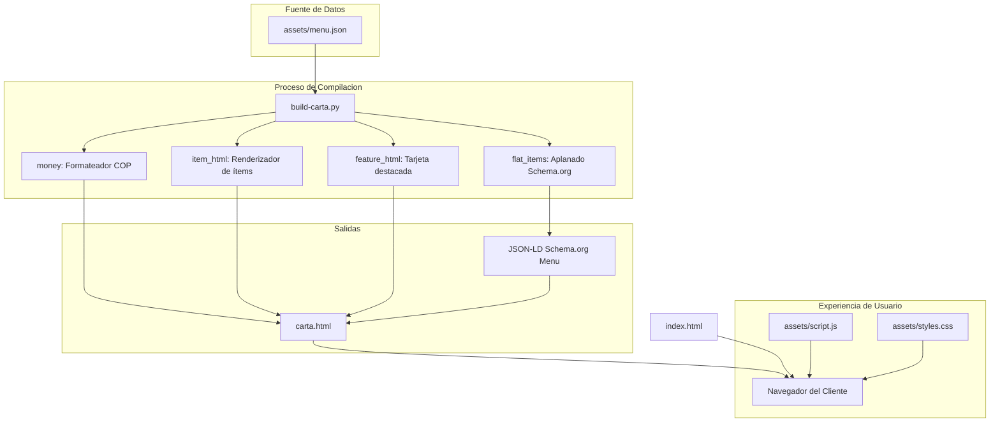

# 📘 Manual de Documentación Técnica y Arquitectura del Sistema
**Proyecto:** La Sabrosura del Mar (Armenia, Quindío)  
**Tipo de Sistema:** Jamstack estático de alto rendimiento con SSG ligero en Python  
**Desarrollado para:** La Sabrosura del Mar  
**Fecha de Referencia:** Septiembre de 2026  

---

## 📑 Tabla de Contenidos
1. [Introducción y Filosofía Arquitectónica](#1-introducción-y-filosofía-arquitectónica)
2. [Estructura del Proyecto y Flujo de Datos](#2-estructura-del-proyecto-y-flujo-de-datos)
3. [Modelo de Datos: `assets/menu.json`](#3-modelo-de-datos-assetsmenujson)
4. [Compilador SSG: `build-carta.py`](#4-compilador-ssg-build-cartapy)
5. [Frontend Interactivo: `assets/script.js`](#5-frontend-interactivo-assetsscriptjs)
6. [Estructura y Semántica de Vistas HTML](#6-estructura-y-semántica-de-vistas-html)
7. [Sistema de Diseño: `assets/styles.css`](#7-sistema-de-diseño-assetsstylescss)
8. [Estrategia SEO y Datos Estructurados (Schema.org)](#8-estrategia-seo-y-datos-estructurados-schemaorg)
9. [Guía Práctica de Operación y Mantenimiento](#9-guía-práctica-de-operación-y-mantenimiento)
10. [🚀 Roadmap Modular y Migración a Astro (`docs/`)](file:///d:/Usuarios/ACER/Documentos/88/sabrosura-del-mar/sabrosura%202/docs/README.md)

---

## 1. Introducción y Filosofía Arquitectónica

El sitio web de **La Sabrosura del Mar** ha sido concebido bajo los principios del **Jamstack moderno** y **Zero-Dependency**:

- **Cero Dependencias en Runtime:** No depende de Node.js, librerías pesadas (como React o Vue) ni paquetes de terceros (como jQuery o Bootstrap).
- **Compilación Estática Ligera (SSG):** Toda la carta digital se administra en un archivo de datos estructurado ([menu.json](file:///d:/Usuarios/ACER/Documentos/88/sabrosura-del-mar/sabrosura%202/assets/menu.json)) y un script estándar de Python ([build-carta.py](file:///d:/Usuarios/ACER/Documentos/88/sabrosura-del-mar/sabrosura%202/build-carta.py)) genera el archivo HTML compilado ([carta.html](file:///d:/Usuarios/ACER/Documentos/88/sabrosura-del-mar/sabrosura%202/carta.html)).
- **Autonomía Operativa:** El sitio completo puede subirse a cualquier servicio de hosting (cPanel/FTP, Vercel, Netlify, Cloudflare Pages o AWS S3) sin necesidad de configuraciones especiales.
- **Rendimiento Máximo y Core Web Vitals:** Fuentes variables auto-alojadas (*self-hosted*), sin peticiones a CDNs externos que bloqueen el renderizado y carga perezosa (*lazy loading*) nativa en imágenes.

---

## 2. Estructura del Proyecto y Flujo de Datos

```
sabrosura 2/
├── DOCUMENTACION_TECNICA.md # Este documento de referencia
├── README.md               # Resumen inicial de entrega
├── index.html              # Landing page principal (Inicio, Sedes, Historia, Contacto)
├── carta.html              # Carta digital generada (para comensales y códigos QR)
├── build-carta.py          # Script generador estático de carta.html
├── robots.txt              # Directivas para rastreadores web (SEO)
├── sitemap.xml             # Mapa de URLs canónicas del sitio
└── assets/
    ├── menu.json           # ⭐ FUENTE DE VERDAD de platos, precios y categorías
    ├── script.js           # JavaScript interactivo vanilla (~4.7 KB)
    ├── styles.css          # Hoja de estilos con variables nativas (:root)
    ├── fonts/              # Tipografías variables WOFF2 (Fraunces e Inter)
    ├── logo.png / -sm.png  # Identidad visual (versiones estándar y fondo oscuro)
    └── *.jpg               # Fotografías de platos en formatos responsive
```

### Diagrama del Flujo de Datos



---

## 3. Modelo de Datos: `assets/menu.json`

El archivo [assets/menu.json](file:///d:/Usuarios/ACER/Documentos/88/sabrosura-del-mar/sabrosura%202/assets/menu.json) almacena la totalidad de la oferta gastronómica. Desacoplar los datos del marcado HTML permite actualizar precios sin riesgo de romper el diseño visual.

### Propiedades Raíz
- `moneda` *(string)*: Código de divisa ISO (`"COP"`).
- `actualizado` *(string)*: Período de vigencia (ej. `"2026-09"`).
- `nota` *(string)*: Texto legal sobre disponibilidad y variaciones.
- `categorias` *(array)*: Lista ordenada de secciones del restaurante.

### Estructura de una Categoría
| Campo | Tipo | Requerido | Descripción |
|---|---|:---:|---|
| `id` | `string` | Sí | Slug URL para anclas (ej. `"pescados"`, `"cazuelas"`). |
| `nombre` | `string` | Sí | Nombre para navegación y encabezados `<h2>`. |
| `resumen` | `string` | Sí | Subtítulo descriptivo de la categoría. |
| `destacado` | `object` | No | Tarjeta grande con imagen del plato insigne de la sección. |
| `items` | `array` | Condicional | Lista de platos (usado si la categoría es plana). |
| `subgrupos` | `array` | Condicional | Lista de agrupaciones internas (ej. en Bebidas). |
| `notaFinal` | `string` | No | Aclaración al pie de sección (ej. precios según temporada). |

### Variaciones en los Ítems de Comida
El sistema soporta 4 modalidades de presentación de precio:

```json
// Caso 1: Precio estándar simple
{ "nombre": "Filete de tilapia apanado", "precio": 43000 }

// Caso 2: Porción completa vs Media porción
{ "nombre": "Arroz a la marinera", "precio": 41000, "media": 29000 }

// Caso 3: Dos tamaños o modalidades de preparación
{ "nombre": "Pescado frito", "precio": 37000, "precioAlt": 42000, "notaPrecio": "normal / súper" }

// Caso 4: Precio variable por temporada
{ "nombre": "Langosta rellena", "precioTexto": "Según temporada y peso", "destacado": true }
```

---

## 4. Compilador SSG: `build-carta.py`

Ubicado en [build-carta.py](file:///d:/Usuarios/ACER/Documentos/88/sabrosura-del-mar/sabrosura%202/build-carta.py), este script en Python 3 procesa los datos y compila `carta.html`.

### Desglose de Funciones

#### 1. `money(n)` (Línea 7)
```python
def money(n):
    return "$" + f"{n:,}".replace(",", ".")
```
- **Propósito:** Da formato a los valores monetarios conforme a la convención colombiana (separador de miles con punto).
- **Ejemplo:** `money(41000)` produce `"$41.000"`.

#### 2. `item_html(it)` (Línea 10)
- **Propósito:** Genera la etiqueta `<li>` para cada ítem de la lista.
- **Escape de Caracteres (`html.escape`):** Protege contra inyecciones XSS en nombres y descripciones.
- **Badge Favorito:** Si `it.get('destacado')` es verdadero, inyecta `<span class="menu-item__badge">Favorito</span>`.
- **Lógica Jerárquica de Precios:**
  1. Si existe `precioTexto`: genera un texto flexible.
  2. Si existe `precioAlt`: genera `$precio / $precioAlt <small>nota</small>`.
  3. Si existe `media`: genera `$precio <small>media porción $media</small>`.
  4. Por defecto: genera `$precio`.

#### 3. `feature_html(f)` (Línea 30)
- **Propósito:** Construye la tarjeta destacada de apertura para la sección.
- **Placeholder Inteligente:** Si el plato aún no tiene foto (`f.get('imagen') == None`), genera un bloque con clase `.dish__media--placeholder`, vector SVG de cámara y texto *"Foto pendiente"*, visualizando los pendientes fotográficos sin romper el diseño.

#### 4. `flat_items(c)` (Línea 274)
- **Propósito:** Aplana las categorías con `subgrupos` (como *Bebidas*) para crear una lista uniforme de objetos que se exporta al esquema oficial de Google **Schema.org** (`Menu` $\rightarrow$ `MenuSection` $\rightarrow$ `MenuItem`).

---

## 5. Frontend Interactivo: `assets/script.js`

El archivo [assets/script.js](file:///d:/Usuarios/ACER/Documentos/88/sabrosura-del-mar/sabrosura%202/assets/script.js) está encapsulado en una función autoejecutable (`IIFE`) bajo `'use strict'`.

```javascript
(function () {
  'use strict';
  // Módulos independientes
})();
```

### Módulos Funcionales

### 5.1. Header Dinámico al Scroll (Líneas 8-16)
- Monitorea el scroll del usuario mediante `window.addEventListener('scroll', onScroll, { passive: true })`.
- Si `window.scrollY > 12`, añade la clase `.is-scrolled`, aplicando sombra suave y fondo traslúcido para legibilidad sobre el contenido.
- El parámetro `{ passive: true }` evita que el hilo de procesamiento de la interfaz se bloquee al desplazarse.

### 5.2. Menú Desplegable Móvil (Líneas 18-40)
- **Gestión de Estados ARIA:** Conmuta `aria-expanded="true/false"` en el botón `.nav-toggle` y activa la clase `.is-open` en `#mobile-nav`.
- **Cierre Inteligente:** Se cierra automáticamente al presionar cualquier enlace o al pulsar la tecla `Escape`, devolviendo el foco del teclado al botón hamburguesa (`toggle.focus()`).

### 5.3. Animaciones al Entrar en Pantalla: Reveal (Líneas 42-58)
- Utiliza la API nativa `IntersectionObserver` para observar todos los nodos `.reveal`.
- Al cruzar el umbral del 8% de visibilidad (`threshold: 0.08`), añade la clase CSS `.is-visible` y ejecuta inmediatamente `io.unobserve(entry.target)` para liberar memoria del navegador.
- Si el navegador no soporta `IntersectionObserver`, activa `.is-visible` en todos los elementos sin generar errores.

### 5.4. Sincronización de Barra Sticky (Scroll Spy) (Líneas 60-85)
- Observa las secciones `<section class="menu-section[id]">`.
- Posee un margen negativo asimétrico (`rootMargin: '-30% 0px -60% 0px'`) para detectar con precisión la sección activa en el centro superior de la pantalla.
- **Auto-scroll Horizontal:** Si el enlace activo queda fuera del ancho visible del contenedor en pantallas móviles, ejecuta `a.parentElement.scrollTo({ left: a.offsetLeft - 24, behavior: 'smooth' })`.

### 5.5. Buscador en Tiempo Real de la Carta (Líneas 87-122)
- **Normalización Fonética Unicode:**
  ```javascript
  var normalize = function (s) {
    return s.toLowerCase().normalize('NFD').replace(/[\u0300-\u036f]/g, '');
  };
  ```
  Permite que búsquedas como `"camaron"` coincidan con `"Camarón"`, y `"sopa"` con `"Sopa"`.
- **Filtrado en Cascada:**
  1. Oculta los platos que no coinciden (`.is-hidden`).
  2. Evalúa si una sección quedó sin platos visibles: de ser así, oculta la sección completa (`display: none`).
  3. Oculta las tarjetas destacadas (`.menu-feature`) durante la búsqueda para no entorpecer la lectura de resultados.
  4. Muestra el bloque `.menu-empty` cuando no existen coincidencias.
  5. La tecla `Escape` borra la consulta y restaura la vista.

### 5.6. Año Dinámico en Footer (Líneas 124-126)
- Remplaza el contenido de cualquier elemento con el atributo `[data-year]` por `new Date().getFullYear()`.

---

## 6. Estructura y Semántica de Vistas HTML

### [index.html](file:///d:/Usuarios/ACER/Documentos/88/sabrosura-del-mar/sabrosura%202/index.html) (Landing Page)
1. **Hero de Alta Conversión:** Con `fetchpriority="high"` en la imagen principal y llamadas a la acción claras (WhatsApp y Carta).
2. **Platos Destacados:** Rejilla responsive con fotos optimizadas y tarjetas reservadas para platos pendientes de sesión de fotos.
3. **Diferenciales de Calidad:** Bloque en fondo azul marino con divisores curvos en SVG nativo (sin imágenes externas pesadas).
4. **Línea de Tiempo Histórica:** Hito de fundación en 2018 por Candelaria, consolidación en el Centro y expansión a la sede Norte en 2026.
5. **Sedes Diferenciadas:** 
   - **Sede Centro:** Enlace a llamada y pedidos por domicilio (`Cra. 13 #21-32`).
   - **Sede Norte:** Enfoque en visitas familiares y parqueadero (`Cra. 19 #15 Norte-40, Proviteq`).
   - Botones de "Cómo llegar" con enlace a Google Maps (`destination=...`).

### [carta.html](file:///d:/Usuarios/ACER/Documentos/88/sabrosura-del-mar/sabrosura%202/carta.html) (Carta Digital)
1. Barra sticky con navegación por categorías y campo de búsqueda instantáneo.
2. Contenedor semántico `#carta` con 10 categorías organizadas y 62 ítems.
3. **Optimización para Impresión (`@media print`):** Al enviar a imprimir desde el navegador, se remueven cabeceras, pie de página y botones flotantes, generando una versión limpia y elegante para cartas impresas en papel.

---

## 7. Sistema de Diseño: `assets/styles.css`

El archivo [assets/styles.css](file:///d:/Usuarios/ACER/Documentos/88/sabrosura-del-mar/sabrosura%202/assets/styles.css) centraliza la identidad en `:root`.

### Paleta Cromática
```css
:root {
  /* Marca principal (tonos marinos) */
  --navy-950: #051423;  /* Footers y fondos oscuros profundos */
  --navy-900: #0a2540;  /* Color primario corporativo */
  --navy-800: #123458;  /* Degradados marinos */
  --teal-700: #0e5a72;  /* Precios y acentos costeros */
  --teal-600: #14738f;  /* Estados hover y subtítulos */
  --teal-100: #d9edf3;  /* Fondos de cápsulas informativas */

  /* Acentos cálidos */
  --gold-500: #d99a3f;  /* Botones primarios y badges favoritos */
  --gold-300: #eec894;  /* Acentos sobre superficies oscuras */
  --sand:     #f8f4ed;  /* Fondo de secciones alternas (arena) */
  --sand-deep:#efe7da;

  /* Texto y Neutros */
  --ink:      #14202c;  /* Texto principal de alta legibilidad */
  --muted:    #6c7c8a;  /* Textos secundarios y notas */
  --paper:    #ffffff;
}
```

### Tipografía Fluida con `clamp()`
En lugar de saltos bruscos en puntos de quiebre fijos, las fuentes se escalan de forma continua con la anchura de la pantalla:
- **Display:** `"Fraunces"` (fuente serif variable con remates tradicionales marinos).
- **Cuerpo:** `"Inter"` (fuente sans-serif de legibilidad técnica).
- `--step-0`: `clamp(1rem, 0.96rem + 0.2vw, 1.08rem)`
- `--step-4`: `clamp(2.3rem, 1.6rem + 3.3vw, 4.4rem)`

---

## 8. Estrategia SEO y Datos Estructurados (Schema.org)

Ambas páginas incluyen marcado JSON-LD comprensible para Google y Bing:

### En `index.html`
Define un grafo `@graph` con 2 entidades de tipo `Restaurant`:
- Nombre específico de cada sede.
- Horarios de atención (`11:00` a `17:00` todos los días).
- Teléfonos y coordenadas de ubicación.
- Atributos especiales: `acceptsReservations: false` y `amenityFeature: Parqueadero` en Sede Norte.

### En `carta.html`
Genera dinámicamente un esquema `Menu` con todas las secciones (`MenuSection`) y sus platos (`MenuItem`), incluyendo moneda (`COP`) y ofertas de precio (`Offer`).

---

## 9. Guía Práctica de Operación y Mantenimiento

### Procedimiento 1: Modificar o agregar un plato
1. Abre [assets/menu.json](file:///d:/Usuarios/ACER/Documentos/88/sabrosura-del-mar/sabrosura%202/assets/menu.json).
2. Ubica la categoría (por ejemplo `"arroces"`).
3. Añade el nuevo registro:
   ```json
   {
     "nombre": "Arroz marinero con palmitos",
     "precio": 46000,
     "media": 33000,
     "destacado": true
   }
   ```
4. Guarda el archivo.
5. Abre la consola en la carpeta raíz del proyecto y ejecuta:
   ```bash
   python build-carta.py
   ```
6. El archivo `carta.html` se actualizará de inmediato.

### Procedimiento 2: Reemplazar una foto pendiente
1. Coloca la fotografía en la carpeta `assets/` (ej: `assets/cazuela-mariscos-sm.jpg`).
2. En [assets/menu.json](file:///d:/Usuarios/ACER/Documentos/88/sabrosura-del-mar/sabrosura%202/assets/menu.json), localiza el bloque `destacado` de la categoría deseada y actualiza:
   ```json
   "imagen": "assets/cazuela-mariscos-sm.jpg",
   "pendienteFoto": false
   ```
3. Vuelve a compilar con `python build-carta.py`.

---

## 10. Roadmap Modular y Migración a Astro (`docs/`)

Para desacoplar el frontend en componentes modernos y preparar la migración a **Astro**, consulta los manuales especializados en el directorio `docs/`:

- 📄 **[docs/README.md](file:///d:/Usuarios/ACER/Documentos/88/sabrosura-del-mar/sabrosura%202/docs/README.md):** Índice general de la arquitectura modular.
- 🎨 **[docs/01-diseno-y-activos/identidad-visual.md](file:///d:/Usuarios/ACER/Documentos/88/sabrosura-del-mar/sabrosura%202/docs/01-diseno-y-activos/identidad-visual.md):** Design tokens, paleta cromática, tipografías variables y lineamientos fotográficos.
- 📐 **[docs/01-diseno-y-activos/iconografia-svg.md](file:///d:/Usuarios/ACER/Documentos/88/sabrosura-del-mar/sabrosura%202/docs/01-diseno-y-activos/iconografia-svg.md):** Catálogo de todos los vectores SVG listos para convertir en componentes.
- 🧩 **[docs/02-catalogo-componentes/mapeo-html-a-astro.md](file:///d:/Usuarios/ACER/Documentos/88/sabrosura-del-mar/sabrosura%202/docs/02-catalogo-componentes/mapeo-html-a-astro.md):** Especificación componente por componente con interfaces TypeScript.
- 🗺️ **[docs/03-roadmap-migracion-astro/guia-paso-a-paso.md](file:///d:/Usuarios/ACER/Documentos/88/sabrosura-del-mar/sabrosura%202/docs/03-roadmap-migracion-astro/guia-paso-a-paso.md):** Guía paso a paso para inicializar Astro, tipar con Zod y compilar estáticamente.

---
*Documentación generada para La Sabrosura del Mar.*
