# 🗺️ Roadmap de Migración a Astro: Guía Paso a Paso

Esta guía técnica describe el procedimiento ordenado para migrar el sitio estático HTML/Python a un proyecto moderno en **Astro**.

---

## 🎯 ¿Por qué Astro para este proyecto?

1. **Reemplazo natural de Python:** En lugar de ejecutar `python build-carta.py` cada vez, Astro compila la carta automáticamente al ejecutar `npm run build` o en tiempo real durante `npm run dev`.
2. **Cero JavaScript innecesario:** Astro no envía React ni Vue al cliente; todo el HTML se pre-renderiza en el servidor o en build-time, conservando la velocidad extrema del sitio actual.
3. **Importación directa de `menu.json`:** Astro importa archivos JSON de forma nativa con autocompletado y tipado en TypeScript.
4. **Mantenimiento modular:** Cada sección y elemento visual queda aislado en su propio archivo `.astro`.

---

## 📂 Estructura Propuesta para el Proyecto Astro

```
sabrosura-astro/
├── public/
│   ├── favicon-32.png
│   ├── favicon.png
│   ├── robots.txt
│   └── sitemap.xml
├── src/
│   ├── assets/                # Imágenes optimizadas por Astro (<Image />)
│   │   ├── logo.png
│   │   ├── camarones-apanados.jpg
│   │   └── mojarra-frita.jpg
│   ├── data/
│   │   └── menu.json          # ⭐ Fuente de verdad del menú
│   ├── components/
│   │   ├── icons/             # Iconos SVG individuales
│   │   ├── layout/
│   │   │   ├── Header.astro
│   │   │   ├── Footer.astro
│   │   │   ├── MobileNav.astro
│   │   │   └── WhatsAppFloat.astro
│   │   ├── home/
│   │   │   ├── Hero.astro
│   │   │   ├── DishCard.astro
│   │   │   ├── Timeline.astro
│   │   │   ├── VenueCard.astro
│   │   │   └── WaveDivider.astro
│   │   └── menu/
│   │       ├── MenuNav.astro
│   │       ├── MenuSearch.astro
│   │       ├── MenuSection.astro
│   │       ├── MenuItem.astro
│   │       └── MenuFeature.astro
│   ├── layouts/
│   │   └── BaseLayout.astro   # Metadatos, fuentes, <head>, Schema.org
│   ├── pages/
│   │   ├── index.astro        # Reemplazo de index.html
│   │   └── carta.astro        # Reemplazo de carta.html
│   └── styles/
│       ├── fonts.css          # @font-face locales
│       └── global.css         # Tokens :root y estilos de styles.css
├── astro.config.mjs
├── package.json
└── tsconfig.json
```

---

## 🚀 Fases del Roadmap

```mermaid
gantt
    title Roadmap de Migración a Astro
    dateFormat  X
    axisFormat %d
    section Fase 1: Inicialización
    Crear proyecto e instalar dependencias      :active, 0, 1
    Migrar fuentes y estilos globales          :active, 1, 2
    section Fase 2: Modelo de Datos
    Tipado TypeScript / Zod de menu.json       : 2, 3
    section Fase 3: Componentes
    Layouts (Header, Footer, BaseLayout)       : 3, 4
    Componentes de Carta y Landing             : 4, 6
    section Fase 4: Interactividad
    Migración del buscador y menú móvil        : 6, 7
    section Fase 5: Pruebas y Despliegue
    Validación de Schema.org y Build Estático  : 7, 8
```



---

### Fase 1: Inicialización del Proyecto
1. Iniciar un proyecto limpio de Astro:
   ```bash
   npm create astro@latest sabrosura-astro -- --template minimal --no-install --typescript strict
   ```
2. Copiar las fuentes (`fonts/`) a `public/fonts/` o `src/assets/fonts/`.
3. Mover `assets/styles.css` a `src/styles/global.css` e importarlo en `BaseLayout.astro`:
   ```astro
   ---
   import '../styles/global.css';
   ---
   ```

---

### Fase 2: Tipado Estricto de `menu.json`
Crear `src/types/menu.ts` para garantizar que ningún dato quede sin validar:

```typescript
export interface MenuItem {
  nombre: string;
  precio?: number;
  media?: number;
  precioAlt?: number;
  notaPrecio?: string;
  precioTexto?: string;
  descripcion?: string;
  destacado?: boolean;
}

export interface Subgrupo {
  nombre: string;
  items: MenuItem[];
}

export interface Categoria {
  id: string;
  nombre: string;
  resumen?: string;
  destacado?: {
    nombre: string;
    descripcion: string;
    precio: number;
    precioNota?: string;
    imagen?: string | null;
    alt?: string;
  };
  items?: MenuItem[];
  subgrupos?: Subgrupo[];
  notaFinal?: string;
}

export interface MenuData {
  moneda: string;
  actualizado: string;
  nota: string;
  categorias: Categoria[];
}
```

---

### Fase 3: Migración de Páginas

#### En `src/pages/carta.astro`:
```astro
---
import BaseLayout from '../layouts/BaseLayout.astro';
import MenuSection from '../components/menu/MenuSection.astro';
import menuRaw from '../data/menu.json';
import type { MenuData } from '../types/menu';

const menu = menuRaw as MenuData;

// Generación de Schema.org JSON-LD automática en Build Time
const schemaJsonLd = {
  "@context": "https://schema.org",
  "@type": "Menu",
  "name": "Carta de La Sabrosura del Mar",
  "inLanguage": "es-CO",
  "hasMenuSection": menu.categorias.map(c => ({
    "@type": "MenuSection",
    "name": c.nombre,
    "hasMenuItem": (c.subgrupos ? c.subgrupos.flatMap(sg => sg.items) : (c.items || [])).map(it => ({
      "@type": "MenuItem",
      "name": it.nombre,
      ...(it.precio ? {
        "offers": { "@type": "Offer", "price": String(it.precio), "priceCurrency": "COP" }
      } : {})
    }))
  }))
};
---

<BaseLayout title="Carta digital | La Sabrosura del Mar" jsonLd={schemaJsonLd} activePage="carta">
  <!-- Hero de la carta -->
  <!-- Navegación Sticky de Categorías -->
  <!-- Bucle de Secciones -->
  <div class="container" id="carta">
    {menu.categorias.map(categoria => (
      <MenuSection categoria={categoria} />
    ))}
  </div>
</BaseLayout>
```

---

### Fase 4: Manejo de la Interactividad en Cliente (`script.js`)

En Astro, la interactividad de cliente (el buscador, el menú móvil y el scroll spy) se incluye de forma óptima mediante etiquetas `<script>` estándar:

```astro
<!-- En BaseLayout.astro o en un componente dedicado -->
<script>
  // El código de assets/script.js se coloca aquí directamente.
  // Astro se encarga de empaquetarlo, minificarlo y diferirlo automáticamente.
</script>
```

**Ventaja clave:** No se requiere instalar librerías adicionales ni configurar bundlers para que el buscador y el drawer móvil sigan funcionando con el mismo JavaScript ligero actual.

---

### Fase 5: Compilación y Despliegue Estático

1. Validar la compilación estática:
   ```bash
   npm run build
   ```
2. La carpeta `dist/` resultante contendrá el sitio web 100% estático compilado, listo para alojarse en cualquier hosting web, servidor tradicional por FTP o plataforma Cloud (Cloudflare Pages / Vercel / Netlify).
